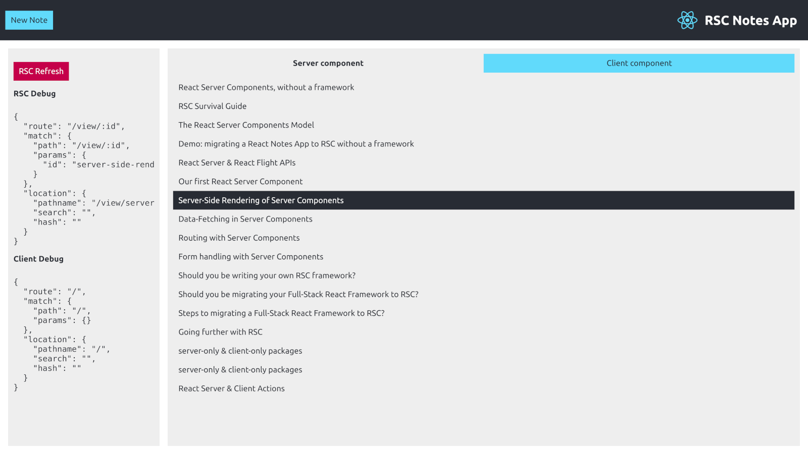

# React Server Components (RSC) Notes App Demo / Playground without a framework



- See the [Live Server Components (RSC) Notes App Demo / Playground](https://rsc-demo.timtech.blog/)
- Read the blog post [React Server Components, without a framework](https://timtech.blog/posts/react-server-components-rsc-no-framework/)

## Disclaimer

Please note, there is absolutely nothing optimal about the following implementation yet, it is purposely naive, incomplete, and is intended for learning & demo purposes.

## Objectives

- a somewhat functional React Notes App (listing, creating, editing & deleting notes with a text title & Markdown content)
- React Server Components used alongside Client Components
- some sort of server-side rendering
- some kind of data-fetching using Server Components
- routing that somewhat works both in the client & on the server
- refreshing server components from the client
- a usable RSC playground
- above all else: learn

## Getting Started

Developed on Node.js v18.18.1 + npm v9.8.1

- `git clone` this repository
- `npm ci`

### Dev Environment

- start a Webpack process, watching for changes in `./src` and outputting built files to `./dist`
- start a Node.js HTTP Server (with Fastify) at http://localhost:3000, watching for changes in `./server`, `./src` & `./dist` with Nodemon

```
npm run dev
```

### Prod Environment

Run the Webpack build & start the Node.js HTTP Server, for production.

```
npm run build
npm start
```

## Main Dependencies

- [Webpack](https://webpack.js.org) bundler
- [Babel](https://babeljs.io) JavaScript compiler, for transpiling JSX syntax
- [Fastify](https://fastify.dev/) for the HTTP web server
- [a-route](https://github.com/WebReflection/a-route) extremely minimal JavaScript / DOM routing library leveraging Custom Elements

## Misc

- Created by [Timothée “Tim” Pillard](https://timtech.blog/about/) [@tpillard on Twitter](https://twitter.com/tpillard)
- ["React Server Components, without a framework" blog post announcement on Twitter](https://twitter.com/tpillard/status/1721848350813585611)
- Based on [React Notes App](https://react-notes-app.timtech.blog/)
